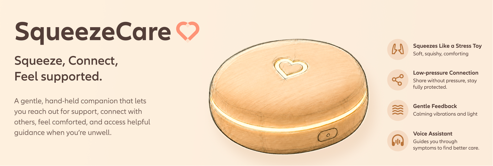
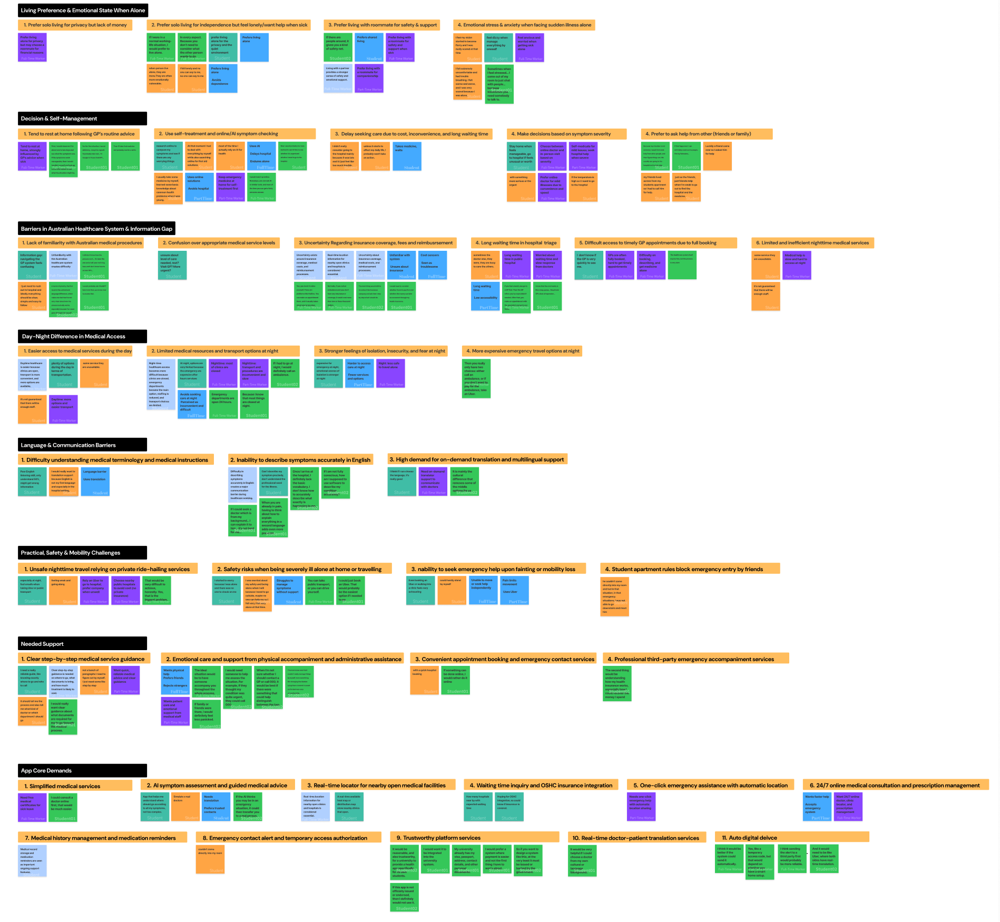
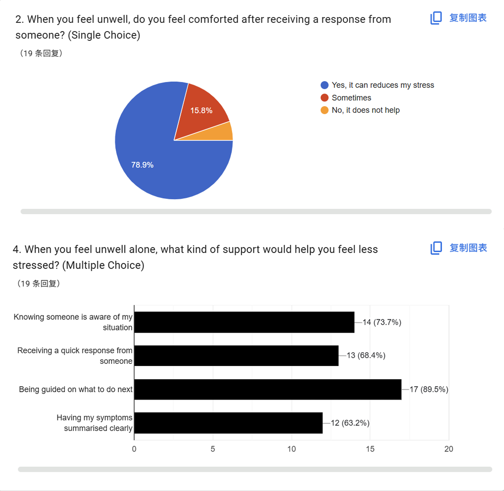
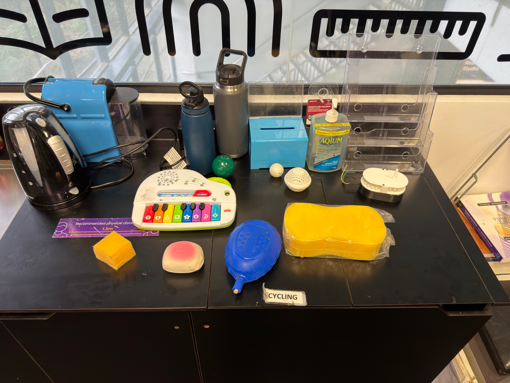
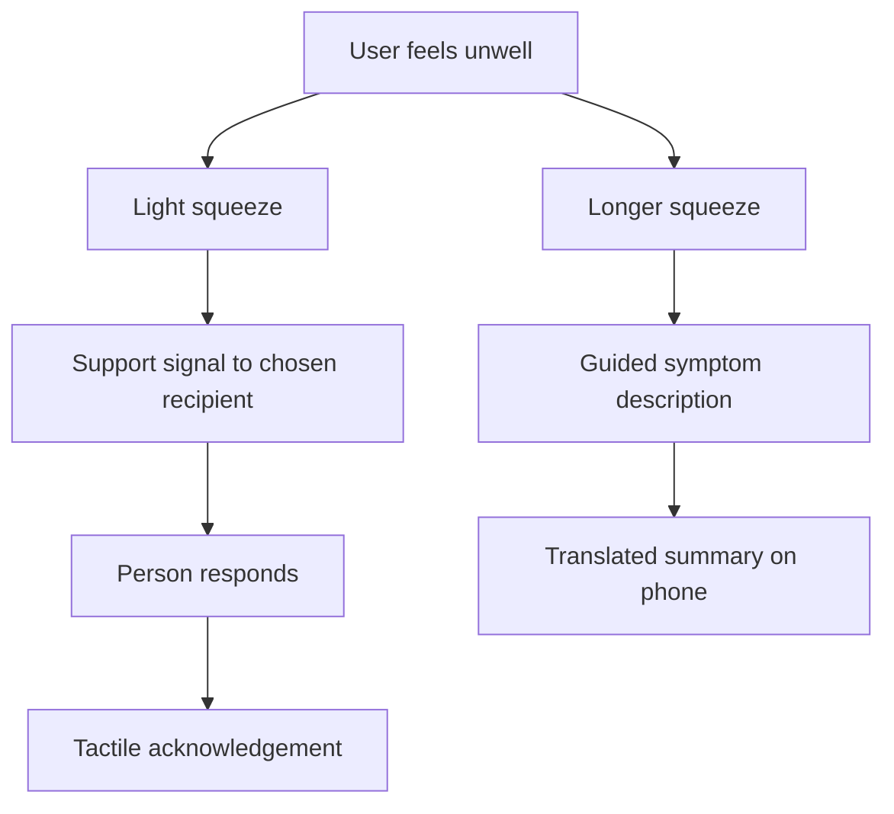
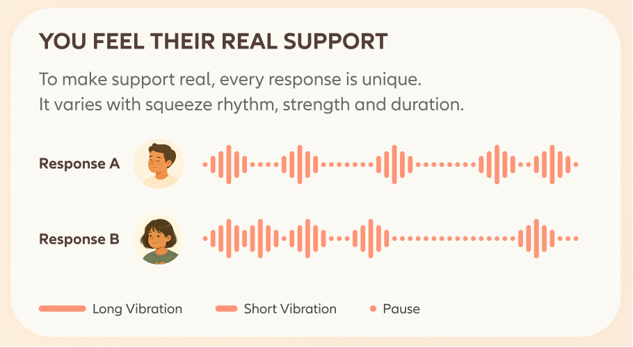

# SqueezeCare Case Study

## Project Summary

SqueezeCare is a physical–digital support concept for international young people who feel unwell while living alone in an unfamiliar environment. It proposes a soft handheld companion for requesting acknowledgement through squeezing, with optional voice assistance to summarise and translate the user’s own symptom description.

The outcome was a research-informed proposal, interaction specification, and exhibition material. The team did not build a working connected device or interactive application. Existing objects supported exploratory research into preferred interaction qualities.

**Context:** Design Computing Studio 3, Team LuckyDogs, 2026  
**My role:** User research, interaction exploration, conceptual modelling, research synthesis, and exhibition research panels  
**Methods:** Semi-structured interviews, questionnaires, open coding, affinity mapping, exploratory object comparison, literature review, and concept sketching

*Concept illustration, rather than a photograph of a built device. Some product imagery in the project used AI assistance.*

## The Problem

When someone feels unwell alone, asking for help can require more energy than they have available. International students and young workers may also need to navigate unfamiliar services and explain their symptoms in a second language. The team’s interviews exposed uncertainty about healthcare pathways alongside isolation, language pressure, and reluctance to burden other people.

The final design question was:

> How might we help international young people living alone feel supported when they feel unwell in an unfamiliar environment?

This framing made the experience before or during help-seeking central to the project. The final proposal focused on acknowledgement and clearer communication, with medical judgement remaining outside the system’s intended responsibilities. [R3, pp. 4–6]

## Three Iterations

| Iteration | Research and framing | What changed |
| --- | --- | --- |
| 1: Night-time medical access | Brainstorming, background reading, and two preliminary interviews considered safety, home access, urgent assistance, and service fragmentation. | Early concepts such as an emergency-access framework and a healthcare dispatcher introduced complex solutions before the evidence and scope were clear. |
| 2: Unfamiliar healthcare | A larger interview study and technology/privacy questionnaire examined support gaps, language pressure, decision uncertainty, and acceptance of digital assistance. | The team narrowed its audience towards international young people and investigated smart-home systems, wearables, and AI assistance. The conceptual model still needed a clearer relationship to a specific interaction opportunity. |
| 3: Support and communication | A further questionnaire, literature review, exploratory object study, and repeated discussion examined the effort of reaching out and expressing symptoms. | The team proposed a squeeze-based companion, separating lightweight human support from optional language assistance. |

The process required returning to the problem definition rather than simply adding features. Tutor feedback helped the team distinguish information needs from the emotional and social burden of using that information while alone and unwell. [R1; R2; R3, pp. 20–24]

## Research Foundation

### Interviews

The team’s main study included **18 participants**. The interim report describes ten international students and eight workers. Open coding and affinity mapping organised their accounts into themes around healthcare unfamiliarity, communication, immediate support, and uncertainty about next steps. [R2, pp. 16–19]

I contributed **three interviews**. My supplied transcripts include accounts of difficulty understanding English medical terms, uncertainty about arranging GP care, and wanting clear, manageable information. These interviews supported the language and support directions without establishing that every participant shared the same experience. [T]

*The map is a team synthesis, not solely my individual work.*

### Technology and Privacy Questionnaire

The first questionnaire collected **37 valid responses**. Among those respondents, 67.6% were willing to share basic health information, compared with 27.0% for personal-relationship information. Interest in smart-home technology and wearables informed the team’s early exploration, while the contrast in disclosure preferences supported more selective data collection. [R2, pp. 18–19]

I helped define the questionnaire’s purpose and sequence, refine answer options, and include choices such as “Prefer not to say.” My contribution treated participant autonomy as part of the research design, rather than something to address only in a future product. [P: questionnaire contribution sections]

## Iteration 3 Research

### Support Needs and Communication

A second questionnaire examined the support people wanted when unwell, the burden of communicating, and preferred interaction qualities. The final report and personal-portfolio charts show **19 responses**.

| Finding | Reported proportion | Design implication |
| --- | ---: | --- |
| Receiving a response could reduce stress | 78.9% | Make acknowledgement a central interaction goal. |
| Knowing someone is aware of the situation would help | 73.7% | Allow a minimal request without requiring a detailed explanation first. |
| A quick response would help | 68.4% | Investigate response expectations and what happens when nobody replies. |
| Difficulty describing symptoms clearly | 73.7% | Explore guided description and a concise summary. |
| Worry about using incorrect English words | 73.7% | Explore translation that preserves the user’s meaning. |
| Language translation would help explain the condition | 78.9% | Include optional communication assistance. |

These are questionnaire responses about needs and preferences. They do not measure the effect of SqueezeCare on stress, health outcomes, or access to care. Some questions permitted multiple selections, so their percentages do not add to 100%. [R3, pp. 10–12; P: second-questionnaire charts]

I helped refine this research towards the language barrier between users and healthcare staff. I proposed examining the difference between literal translation and a clearer summary of everyday symptom descriptions, together with guided questions that could help a user express missing detail. These remained proposed communication functions. Their accuracy and preservation of meaning were not tested with an implemented system. [P: Iteration 3 questionnaire contribution]

### Exploratory Interaction Study

I independently designed and led an object-preference study. Participants imagined a stressful or unwell situation and explored **nine existing physical objects** offering interactions such as squeezing, pressing, pulling, rotating, and rebounding. Video and think-aloud prompts recorded what attracted them to an object and why they preferred its interaction. [P: interaction test]

The intended sessions lasted three to five minutes. In practice, questions and communication took longer than expected. The planned sample reduced from twelve to eight participants, and one participant declined to interact with the provided objects. **Seven usable records** informed the analysis. That refusal also revealed a limitation of the available object selection. [P: interaction-test reflection]

In the seven usable sessions, **five participants selected a squeezable object first**, and all seven included one in their top three. Feedback favoured softness, rounded forms, palm-sized dimensions, and the appeal of squeezing. [R3, pp. 12–13]

The result supported a soft, rounded handheld direction. It did not isolate squeezing from material, appearance, size, or other object qualities. It also did not establish effectiveness during real illness, measure physiological stress relief, or validate a working product.

## Design Rationale

| Observed need or preference | Proposed response | What remains uncertain |
| --- | --- | --- |
| Reaching out can feel demanding | A deliberate squeeze sends a minimal support signal. | Whether users and supporters interpret the signal consistently. |
| Users value acknowledgement | A person responds through a tactile signal. | How the system distinguishes delivery from a human reply and handles silence. |
| Squeezable objects were preferred in the exploratory study | A soft, rounded, palm-sized companion. | Comfort and reliability when users feel weak, dizzy, or in pain. |
| Users struggle to express symptoms in English | Optional guided voice input, translation, and summarisation. | Whether summaries preserve meaning and users can review and correct them. |
| Disclosure preferences vary | User-selected recipients and limited initial information. | Concrete consent, storage, and sharing controls. |

The team also reviewed stress toys, remote-touch products, lightweight message services, voice assistants, and translation tools. Literature informed the direction, while its populations and contexts differed from this project. It provided a reason to investigate tactile support rather than proof that SqueezeCare would produce the same outcomes. [R3, pp. 12–15]

## Proposed Experience

The final concept has two related routes: asking another person for acknowledgement and preparing a symptom description. The user chooses when to enter either route.

This diagram represents proposed behaviour. Neither route was implemented or validated as an end-to-end experience. [R3, pp. 15–17]

### Squeeze and Response

The companion would sense squeeze pressure, rhythm, and duration. A supporter’s squeeze could produce a distinct vibration pattern, giving the response a personal quality beyond a standard notification. Light feedback also appears in the requirements and exhibition materials, although its exact role remained unsettled.

*These patterns are design illustrations. No measured input mapping or working haptic output is demonstrated.*

### Voice and Translation

A longer squeeze would activate guided voice input. The system would organise the user’s description and provide a translated summary on their phone for later communication. A future evaluation would need to check omissions, altered meanings, review controls, and the burden of speaking when unwell.

Some original exhibition graphics use broader language about “decision support.” The final report explicitly restricts AI to communication assistance. This case study follows that narrower scope and treats the original poster as a record of the exhibit, rather than evidence of implemented medical capabilities. [R3, pp. 16–18]

## Stakeholders and Ethical Requirements

The final stakeholder model centres on the person requesting support, trusted contacts who can acknowledge the request, and organisations responsible for the proposed device, service, and data handling. Contacts provide reassurance and practical support rather than medical expertise. [R3, pp. 9–10]

The research led to proposed requirements for deliberate activation, user choice over recipients, minimal disclosure, and an optional voice route. The concept should also make the limits of the signal understandable: a light request for acknowledgement cannot reliably communicate clinical urgency.

Community or anonymous support appears in the concept materials, but its social and privacy rules remain unresolved. Response pressure, harassment, misunderstanding, and unanswered requests would need further investigation before expanding beyond trusted contacts. [R3, pp. 17–20]

Pressure sensors, wireless transmission, LEDs, haptic hardware, and AI translation are proposed implementation requirements. The project did not select and integrate them into a functioning device, verify security controls, or validate translation quality.

## My Contribution

| Area | My documented work |
| --- | --- |
| Interviews | Conducted three interviews within the team’s 18-participant study. |
| Questionnaires | Helped define aims, question structure, options, and the language-focused research direction. |
| Interaction exploration | Independently designed and led the object-preference study, then synthesised the usable records. |
| Conceptual modelling | Developed the early frameworks and corresponding areas of investigation, then revised them following feedback. |
| Research synthesis | Reviewed literature and wrote summaries of solution-exploration activities and team reflection. |
| Collaboration | Recorded and analysed team/tutor discussions, consolidated questions, and shared summaries. |
| Exhibition | Prepared the Iteration 2 panels explaining interview, survey, and technology-research findings. |

The larger research programme and final SqueezeCare concept were collaborative. My personal portfolio identifies another team member as responsible for the final product poster, so I do not claim sole authorship of that visual. [P; T; F]

## Outcome and Reflection

The main outcome was a more focused design opportunity and a documented concept. The project established a basis for further design work, rather than evidence of a successful deployed system.

My early conceptual work introduced specific architectures before their relationship to the research was clear. After feedback, I became more cautious, but the next version largely repeated the problem without opening a useful solution direction. The later work connected observations to research questions and interaction qualities more concretely.

The object study also showed why a research plan needs time for explanation, misunderstandings, and unexpected refusals. A pilot, fewer prompts, and a broader object set would help a future study. Recording these limitations is more useful than treating every exploratory result as validation.

The strongest learning was that design decisions need an explicit connection between evidence, the proposed interaction, and the next question to investigate. That relationship made the final proposal clearer while preserving the uncertainties a future build would need to address.

## Next Research and Development

| Next activity | Question to investigate |
| --- | --- |
| Compare soft mock-up forms | Where would users keep the object, and can they hold it comfortably? |
| Test squeeze mappings in scenarios | Can users distinguish a support request from voice activation without accidental signals? |
| Simulate replies and unanswered requests | Do users understand what the system and another person have acknowledged? |
| Evaluate guided symptom summaries | Can users understand and correct omissions or mistranslations? |
| Explore consent and recipient controls | Can users request reassurance without disclosing more than intended? |
| Build and test a limited technical proof of concept | Can sensing, transmission, and feedback support the proposed interaction reliably? |

These are future activities, not completed milestones. Realistic testing should also consider differences in language, physical ability, social support, and the energy available when unwell. [R3, pp. 19–21]

## Sources and Original Exhibit

Source labels in this case study refer to the supplied project materials:

- **R1:** ProblemReport_LuckyDogs.pdf, Iteration 1.
- **R2:** Studio3-Proposal-2026-Interim-LuckyDogs.pdf, Iteration 2.
- **R3:** Studio3-Proposal-2026-1-Final-Luckydogs.pdf, final report dated 27 May 2026.
- **P:** Screenshots of Arthur’s individual course portfolio, including the research, contribution, and reflection sections.
- **T:** Interview Transcript Zirui Zhou.docx, containing three personal interview records.
- **F:** Zirui_Zhou_Reflection.docx, documenting early contributions and collaboration.

The three presentation sets also provide context for the iterations. Their data snapshots and some exhibit wording differ from the final report; see the [Evidence Notes](docs/EVIDENCE-NOTES.md).

[View the original team exhibition poster](assets/project-poster.png). The original poster is preserved unchanged. Some product illustrations used AI assistance, as acknowledged by the team.
